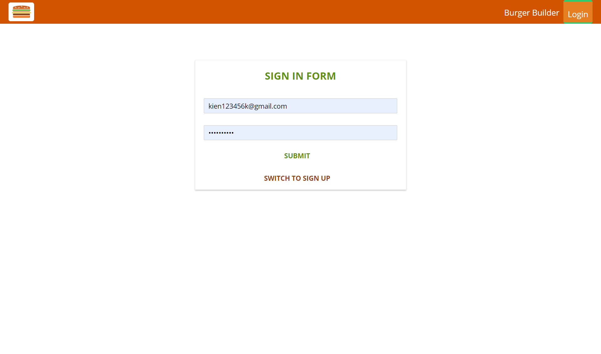
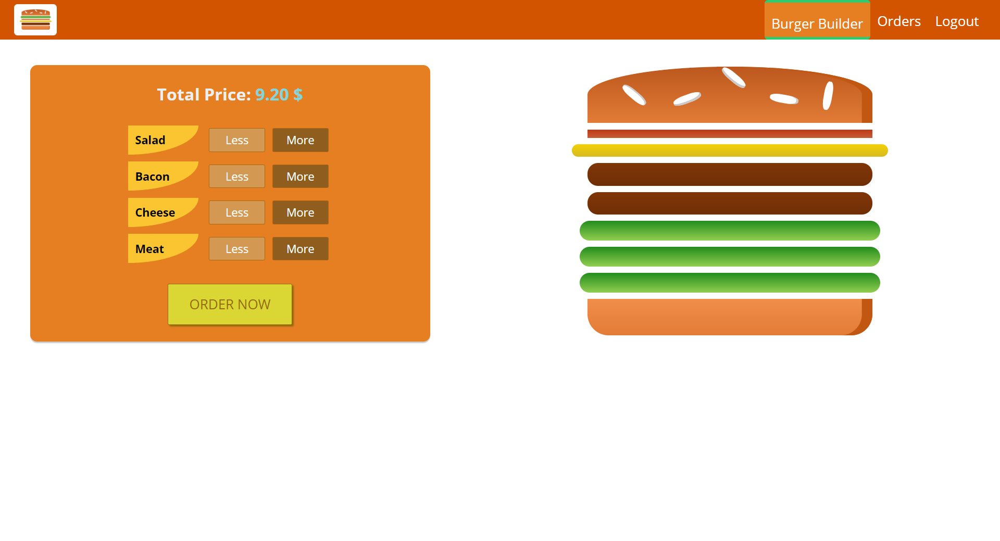
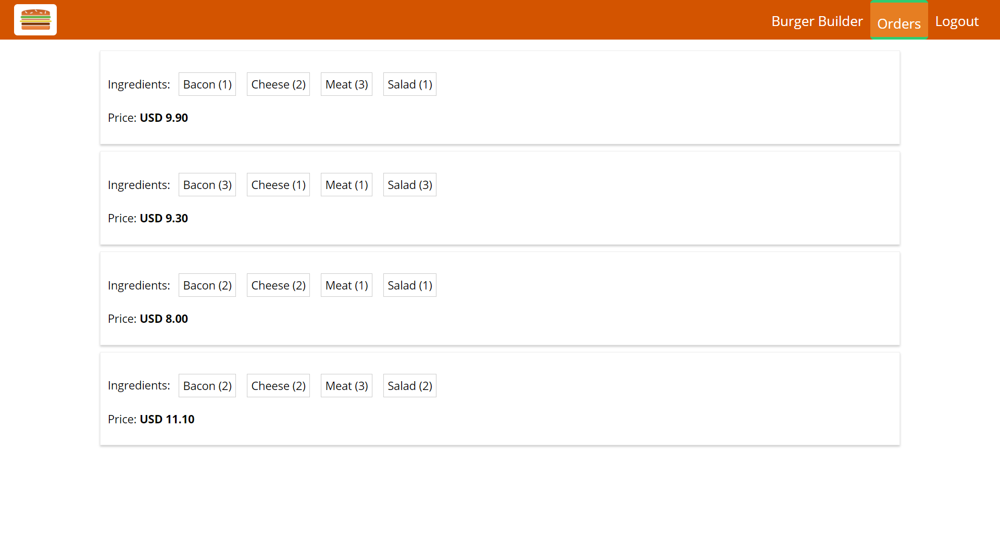
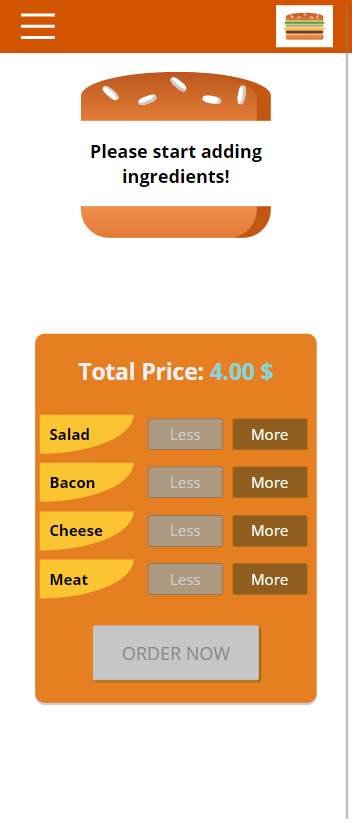
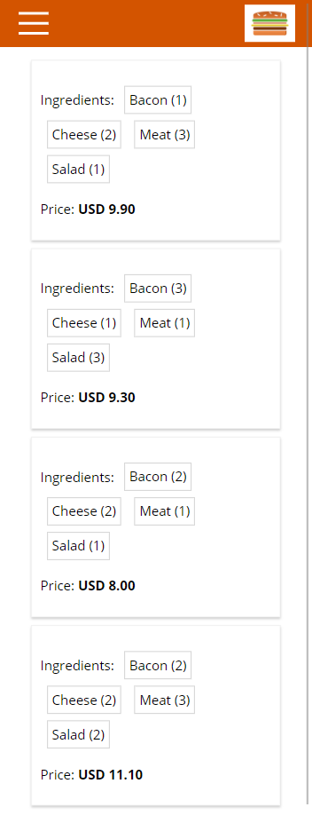

#  Burger Booking 

## [Live Demo](https://www.youtube.com/watch?v=CvsKmp0oAo4)
## What is Burger Booking?
- A burger booking application that help you order the burger as you wish for.
- The main purpose of this project is to practice React, Redux and Redux's support ecosystem with its best practice.
- Therefore, this application should be used for production because it's created to be quite simple so as for everyone easy to understand the workflow.
You can consider using Burger Booking for produciton if only you improve it.

## Technology
- Frontend
  - React - A JavaScript library for building user interfaces
  - Create React App - React Starter Template
  - Redux-Toolkit - State Management
- Backend
  - Firebase - Authentication, Realtime Database.

**Note:** switch to branch `pure-redux` if you want to see this application managed by [Redux](https://redux.js.org/) and [Redux-Saga](https://redux-saga.js.org/).

## Some preview images
&nbsp;
&nbsp;

## Available Scripts
Before jump in to run this application:
- First, remember to create a `.env.local` file with content exactly like `.env.example` file content.
- Then replace  `your_firebase_sign_in_api`, `your_firebase_sign_up_api` and `your_firebase_realtime_db_api` with your  [Firebase](https://firebase.google.com/) API respectively.

In the project directory, you can run:

### `yarn start`

Runs the app in the development mode.\
Open [http://localhost:3000](http://localhost:3000) to view it in the browser.

The page will reload if you make edits.\
You will also see any lint errors in the console.

### `yarn test`

Launches the test runner in the interactive watch mode.\
See the section about [running tests](https://facebook.github.io/create-react-app/docs/running-tests) for more information.

### `yarn build`

Builds the app for production to the `build` folder.\
It correctly bundles React in production mode and optimizes the build for the best performance.

The build is minified and the filenames include the hashes.\
Your app is ready to be deployed!

See the section about [deployment](https://facebook.github.io/create-react-app/docs/deployment) for more information.

### `yarn eject`

**Note: this is a one-way operation. Once you `eject`, you can’t go back!**

If you aren’t satisfied with the build tool and configuration choices, you can `eject` at any time. This command will remove the single build dependency from your project.

Instead, it will copy all the configuration files and the transitive dependencies (webpack, Babel, ESLint, etc) right into your project so you have full control over them. All of the commands except `eject` will still work, but they will point to the copied scripts so you can tweak them. At this point you’re on your own.

You don’t have to ever use `eject`. The curated feature set is suitable for small and middle deployments, and you shouldn’t feel obligated to use this feature. However we understand that this tool wouldn’t be useful if you couldn’t customize it when you are ready for it.

## Learn More

You can learn more in the [Create React App documentation](https://facebook.github.io/create-react-app/docs/getting-started).

To learn React, check out the [React documentation](https://reactjs.org/).

# License & copyright

© Kirin Tran, FPT University TP.HCM
Licensed under the [MIT LICENSE](LICENSE).